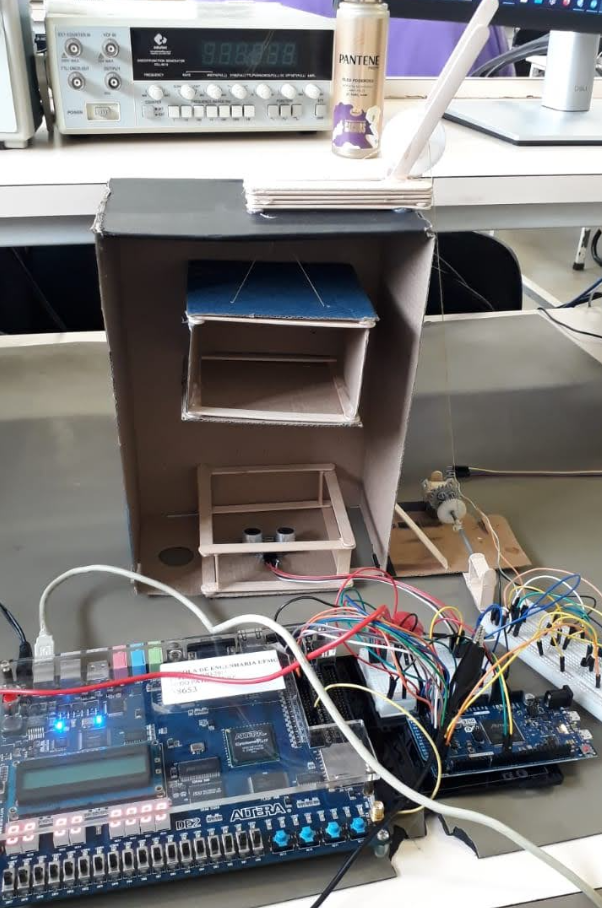
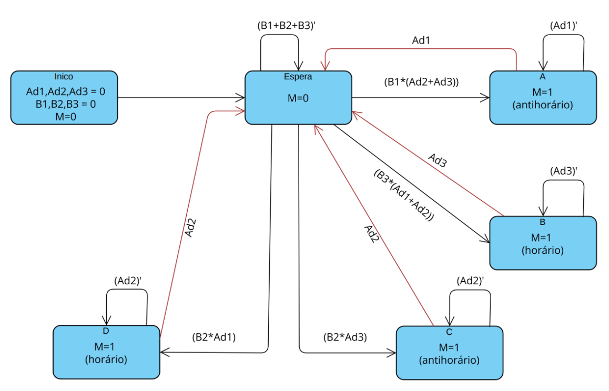

# Trabalho-de-Sistemas-Digitais-Elevador
Este trabalho teve como objetivo colocar em prática os conhecimentos adquiridos durante as aulas do Laboratório de Sistemas Digitais além de explorar a interação do FPGA e do kit Altera DE2 com o mundo físico.

Foi desenvolvido o projeto de um elevador de papelão de 3 andares controlado pelo FPGA e por um Arduino Due. O código voltado para o FPGA foi escrito em VHDL a partir do software Quartus II, já o código do Arduino foi escrito em C++ utilizando o Arduino IDE. A comunicação entre eles foi realizada a partir das portas GPIO do kit Altera DE2.

## Máquina de Estados Finitos
A máquina de estados finitos foi responsável por guiar a escrita do código através da separação dos estados e das condições de transição, além do que acontece dentro de cada estado. 

Ad1, Ad2 e Ad3 referem-se aos andares de forma que possuem o valor ‘1’ quando o elevador se encontra naquele respectivo andar. B1, B2 e B3 referem-se aos botões de seleção dos andares e possuem o valor ‘1’ quando um andar é selecionado. M refere-se ao motor, M = 1 significa motor ligado sendo que o sentido pode ser horário ou anti horário, nessa ordem, equivalente ao elevador subir ou descer.

## Materiais

- Arduino Due
- FPGA
- Motor CC
- Sensor Ultrassônico
- Transistor BC337
- Jumpers
- Caixa de papelão
- Palito de picolé
- Engrenagem de plástico
- Linha
